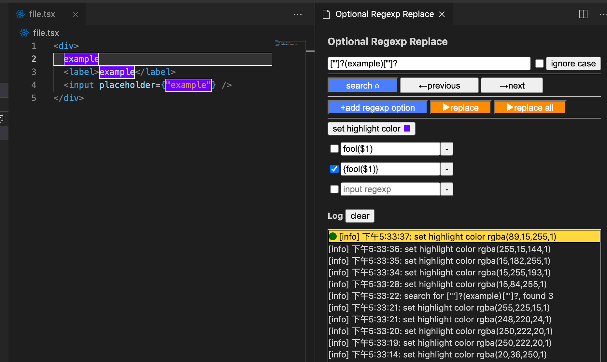

# Optional Regexp Replace

A Visual Studio Code extension to find and replace optionally.

一个可以选择性替换的vs code插件。

## Features

In Visual Studio Code, it can only replace one to one,
sometimes want to replace it selectively, you have to repeatedly correct RegExp. With this Extension you can write several RegExps and select one to replace.

在vs code中，只能填入一对find/replace，使用这个插件，你可以填写多个正则，选择其中一个进行替换。

> 1. you can use RegExp just like in Visual Studio Code, the replacement use `String.prototype.replace`.
> 2. The RegExp options will restore on next open the extension.

## Install

copy `vscode:extension/qilejia.optional-regexp-replace` to browser or search **optional-regexp-replace** in [Visual Studio Code Extensions Market](https://marketplace.visualstudio.com/search?target=VSCode&category=Other&sortBy=Installs) to download.

## Use

press `Ctrl + Shift + P` or `Cmd + Shift + P` in Visual Studio Code and search **optional regexp replace**.

## Issue
Report bug or need help [click here](https://github.com/yilingapa/optional-regexp-replace/issues).

----------------------------------------------------------------------------------------------------------------

## Enjoy!
